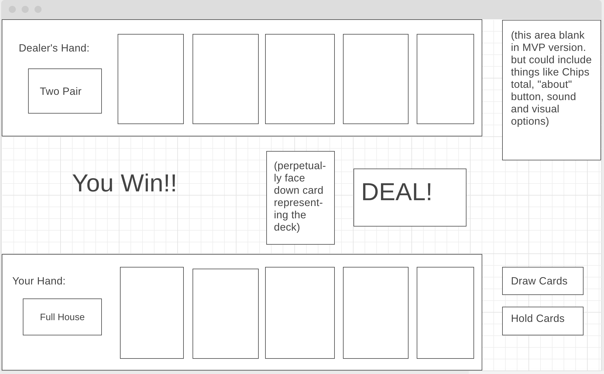

# Penguin Poker

## Motivations and Process

I built this because I wanted a challenge. This game formed my first project for the General Assembly Software Engineering immersive. It was completed in a week and when I made it I only had two weeks of experience with javascript. We built a simple war (high card) game in class, so I felt fairly confident that I could build another card game. At the same time I wanted one which would push me to build some fairly complex functions, loops, and objects, to practice everything I had learned so far. While this game is heavier on Javascript, I felt it would be a good challenge for my CSS skills, a language I am little less confortable with than Javascript. 

To me, the core of this project was writing functions to take five cards and accurately describe them as a Poker hand, such as Three of a Kind, Straight, Full House etc. On a project such as this I generally dive in at the point of greatest complexity, so that was the first problem I chose to tackle. Before anything else though, I had to decide the basic data structures to be used. I settled on objects for the cards, each with attributes of suit, rank, and a name which would later be used to tie to an image file. These 52 cards were stored in a Deck array which, once shuffled, could supply to instances of a Hand class. The Hand class includes several different arrays which variously organized the cards for different purposes; many booleans, such as isFlush and isTwoPair, which are used to store information about the hand; and several functions to determine how these arrays are filled and which boolean(s) evaluate to true.

One function in particular I'd like to highlight, is how I determined matches between the cards - Pairs, Three of a Kinds, Full Houses. I was very determined to get all this info with one function, but I was unsure initially how to do so. One early idea I had was to simply compare all five cards against all five cards and increment a counter variable with each match. While this technically would have worked, it felt a little sloppy. I wanted a method that would also store the cards in an array that I could access later.

Here's what I came up with: 

        this.allMatches = []
        this.matchesArray = []
        this.inMatch = false
        for (i = 1; i < 5; i++) {
            if (this.sortedCards[i].rank === this.sortedCards[i - 1].rank && this.inMatch === false) {
                this.matchesArray.push(this.sortedCards[i], this.sortedCards[i - 1])
                this.inUseCards.push(this.sortedCards[i], this.sortedCards[i - 1])
                this.inMatch = true
            } else if (this.sortedCards[i].rank === this.sortedCards[i - 1].rank && this.inMatch === true) {
                this.matchesArray.push(this.sortedCards[i])
                this.inUseCards.push(this.sortedCards[i])
            } else if (this.sortedCards[i].rank !== this.sortedCards[i - 1].rank && this.inMatch === true) {
                this.allMatches.push(this.matchesArray)
                this.matchesArray = []
                this.inMatch = false
            }
        }
        // If matchesArray still has a little left (the case where the lowest card is part of a pair, three of a kind et cetera)
        if (this.matchesArray.length > 0) {
            this.allMatches.push(this.matchesArray)
        }

Part of what makes this method elegant is that it uses the sortedCards array-- all five cards sorted from highest to lowest. I needed to create this array anyway for tie breaker situations, but I soon realized it would help me with a myriad of problems including this one. Since any cards of equal rank will be adjacent in the sortedCards array, I needed only to compare each card to the one before it to determine if it was a match. (I could have also compared to the one afterwards for the same effect.) The for loop begins with second card since the first card has no card before it to compare to. A boolean, inMatch tracks whether the method is actively within a match. If so, it only adds the current card to the matchesArray. If not, it adds the current card AND the previous. This is because the previous card is also part of the match but won't have been pushed to the matchesArray yet, since it is the very first card of the match. Lastly (second else if statement) if a card is NOT a match, but we are currently within an active match, the program recognises that the match is over. The completed matchArray is pushed to the allMatches array, which stores it along with any other matches. allMatches is an array which stores arrays. It will only ever have at most two elements, in the case of a Full House or Two Pair. From the lengths of the arrays within the all matches array we can determine the value of our hand: 2 for a pair; 3 for a three of a kind; 4 for a four od a kind; 2, 2 for Two Pair; 3, 2 for a Full House.

## Developing the Dealer

You may have noticed in the above code another array I haven't mentioned yet -- inUseCards. It's filling with the same cards that get put in allMatches, but it stores them in only one level of structure. As the name suggests, inUseCards simply stores all the cards that are currently being used to create a certain hand. inUseCards helps to solve one of the more complicated problems of Penguin Poker: creating a "computer" or "dealer" player that actually plays poker intellegently.

From the very first planning stages I gravitated towards the five card draw form of poker. The decision to discard certain cards and get new ones gives the player an interesting choice, even in cases where there is no gambling involved. However, I quickly realized this created a problem: if the player can replace cards, the computer needs to be able to do so also, or the player would be greatly overpowered. 

To help solve this issue I built the Hand class to be flexible, allowing it to take cards as input and just fill in the rest:

    this.cards = cards;
        this.numberOfCardsNeeded = 5 - this.cards.length;
        for (i = 1; i <= this.numberOfCardsNeeded; i++) {
            this.cards.push(deck.shift())
        }

When each hand begins an instance of the Hand class is created for each of the players which takes no cards arguments and therefore grabs five from the shuffled deck. 

    playersHand = new Hand ([])
    computersHand = new Hand ([])

When computer needs to replace cards it keeps the cards it already store in inUseCards and fills in the remaining cards from the deck:

    computersHand = new Hand(computersHand.inUseCards)

The player's new hand, by contrast, simply keeps the cards the player selected:

    playersHand = new Hand(playersHand.selectedCards)

Once I solved these core problems, it was surprisingly easy to expand the game with new features, each exanding on the last. The biggest thing I learned from this project is to always think one step ahead when coding. Some of the features I added later in the week were surprisingly easy to implement because I had built previous to be flexible and to generate as much data as possible. One example of this is the betting system. I originally wanted to have two identical rounds of betting per hand. Once I started coding it however, I realized it would be more interesting to make the second hand involve an offer, or "raise", a situation which allowed me to expand the dealer. Here's how the raise is calculated:

    raise = computersHand.handValue.value + 2
    raise = raise + Math.floor(Math.random() * 5)
    raise = Math.max(Math.min(raise, 10), 1)
    raise = Math.floor(raise * chips * .1)

The computer's handValue.value is a number from 0 (no hand/ high card) up to 8 (the rare straight flush). The second line randomly increases it to make it a little harder for the player to deduce to the exact hand of the dealer from their raise. The third line makes sure the raise has a value between 1 and 10. In the fourht line this number is translated into some percentage--between 10% and 100%--of the player's chips. The player's current chips is a factor so that later in the game as the player accumulates more and more they will still be challenged to place bets that could actually hurt them.

## Future Directions

If I continued work on this project, it would be in the area of improving its design. I think there is still work to do in making it look cleaner, and generally improve the look of the buttons and other page elements. I'd also considering adding some music options. I'd also like to add a favicon.

For future games I'd like to try a game which uses a grid like sudoku, minesweeper, or tetris. Any of these games would build my skills in CSS as well as challenge me to do complex manipulation of data in javascript.

I'd also like to do a story based game, perhaps with management elements. This would really push me to the next level in terms of design. 

## Original Proposal for Project

##### MVP User story:

0. User loads web page. 
    User has the option of a "Deal" button

1. User hits "Deal" button. 
    The user receives 5 cards they can see at the bottom of the screen. At the top is five cards face down -- the computer's hand. 
    User now has the option of two buttons: "Draw cards" or "Keep cards"

2. Three possibilities here:

    User hits "Keep Cards". Nothing happens. Proceed to next step.

    User selects several of the cards by clicking, then clicks "Draw Cards". The cards selected are replaced by new cards. Proceed to next step.

    User selects no cards but hits "Draw Cards" anyway. An alert is displayed: "Click on the cards you want to discard before clicking 'Draw Cards'". Do not proceed.

3. Here the computer replaces cards. There is some kind of visual or textual indication how many cards are being drawn. 
    The computer will decide how many/which cards to replace by a deterministic algorythm based on the hand they currently have. A rough idea of how that'd work:
        For Straight Flush, Flush, Straight, Full House: replace 0
        For Four of a Kind and Two Pair: replace 1 
        For Three of a Kind: replace 2 
        For Pair: replace 3
        For No Hand: replace 3 lowest cards

4. The computer's cards are revealed. The hand (e.g. Full House, Two Pair) is declared in text for both the user and the computer. 
    Text displays "You win!" or "You lose!" 
    User has the option of a "Deal" button 
    Cards are returned to the deck and deck reshuffled

Steps 1-4 repeat.

##### Nice-To-Haves and stretch goals beyond MVP (in roughly the order I would pursue them):

1. A betting system. 
    The user begins with 1000 chips. 
    After steps 1 and 3 the user can make a wager. 
    The computer always calls on the wager. 
    When "You win!" or "You lose!" displays, so does a message stating "+[size of pot] chips" or "-[size of pot] chips" respectively.
    The user's chips total increases or decreases with each hand.
    A "Bust!" message and "play again!" button to display if chips reach 0. 

2. Theming the card game and other visual improvements to help it stand out.
   Not entirely sure what theme I would go with, but the one I like the most so far is "Penguin Poker", so I will use that here as an example. 
    The back of the card image would portray a drawing of penguin (think clip art).
    The background image for the game would potray an antarctic landscape. 
    A toggle that would give the option of light or dark mode. For dark mode the background would be a picture of antarctica at night.
    An "about" button which shows text, explaining the flow of the game in depth for particularly curious/confused users.
    Custumized card faces to fit the theme.
    A timer counts down 3, 2, 1 before hands are revealed.
    Mobile responsive design.
    New themes unlocked by reaching certain scores.

3. Sound effects and music to go with the game. Toggles for the user to turn them on and off.

4. A more complicated computer AI. 
    A small degree of randomness is introduced into the computer's decision to draw x number of cards.
        e. g. If the computer has one pair, it will sometimes only replace two of its unused cards instead of all three.
    The computer strategically will make certain decisions with higher and lower probability based on the rank of its cards
        e. g. If the computer has one pair, it will be more likely to keep one of its unused cards if that card is an Ace or King.

5. Giving the computer the option to fold or raise in the betting system, in addition to calling. 

6. Card couters mode: rather than the deck being shuffled every hand, it is only shuffled when depleted. 

##### Wireframe

##### Behind the scenes

When the user hits "Deal!" the deck array will be shuffled. 
The Hand class will take five card objects from the deck array to create an instance of the Hand class assigned to the playersHand variable
Five more to constitute the computer's hand and assign it to the computersHand variable
These card objects will have keys: rank (2 to 14 to represent 2 to Ace), suit (A, C, H, D), and name (e.g. KS, 4D, AH) which will tie it to an image file
The Hand class will organise the five cards it takes into an array sorted from high to low by rank.
The Hand class will have many booleans such as isFlush, isStraight, isTwoPair. 
It may also have some arrays to store sub-sets of its cards. For instance, a pairArray which could contain two cards with matching ranks.
These booleans and arrays will be controlled by several methods, such as checkFlush, checkStraight, getMatches
If the user hits "Draw Cards" the playersHand variable will be reassigned to a new instance of the Hand class.
This instance will be constituted from the cards the player is keeping plus the first cards from the deck which are needed to reach five cards.
A function will run to determine which cards the computer will discard, based on the booleans/arrays of computersHand.
If the computer receives new cards, the computersHand variable will be reassigned to a new instance of the Hand class.
A function determines the winner of the hand by comparing the boolean values of the playersHand and computersHand objects.
The first compared would isStraightFlush, then isFourOfAKind, down to isPair. If a boolean is true for one but no the other, that hand wins.
In the case that both booleans evaluate to true, a tie breaker function would run, comparing the ranks of the hands.
For the tie breaker the arrays of each hand object might be used. This could help distinguish between a pair of kings and a pair of 10s, for instance.
DOM elements display the winner and the hand of both player and computer, and reveal again the deal button. 
