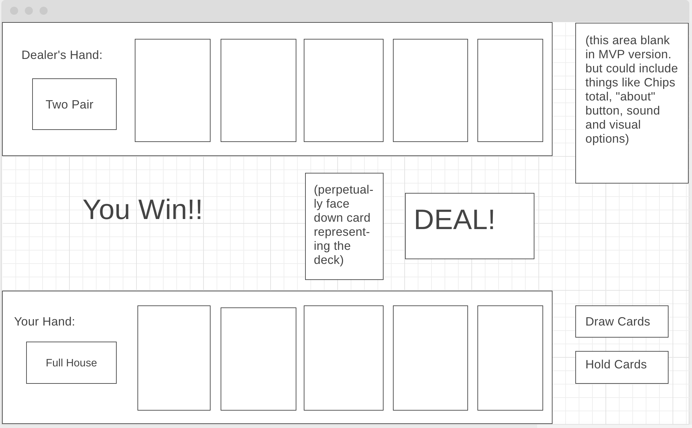

# Poker: Five Card Draw

MVP User story:

0. User loads web page. 
    User has the option of a "Deal" button

1. User hits "Deal" button. 
    The user receives 5 cards they can see at the bottom of the screen. At the top is five cards face down -- the computer's hand. 
    User now has the option of two buttons: "Draw cards" or "Keep cards"

2. Three possibilities here:

    User hits "Keep Cards". Nothing happens. Proceed to next step.

    User selects several of the cards by clicking, then clicks "Draw Cards". The cards selected are replaced by new cards. Proceed to next step.

    User selects no cards but hits "Draw Cards" anyway. An alert is displayed: "Click on the cards you want to discard before clicking 'Draw Cards'". Do not proceed.

3. Here the computer replaces cards. There is some kind of visual or textual indication how many cards are being drawn. 
    The computer will decide how many/which cards to replace by a deterministic algorythm based on the hand they currently have. A rough idea of how that'd work:
        For Straight Flush, Flush, Straight, Full House: replace 0
        For Four of a Kind and Two Pair: replace 1 
        For Three of a Kind: replace 2 
        For Pair: replace 3
        For No Hand: replace 3 lowest cards

4. The computer's cards are revealed. The hand (e.g. Full House, Two Pair) is declared in text for both the user and the computer. 
    Text displays "You win!" or "You lose!" 
    User has the option of a "Deal" button 
    Cards are returned to the deck and deck reshuffled

Steps 1-4 repeat.

Nice-To-Haves and stretch goals beyond MVP (in roughly the order I would pursue them):

1. A betting system. 
    The user begins with 1000 chips. 
    After steps 1 and 3 the user can make a wager. 
    The computer always calls on the wager. 
    When "You win!" or "You lose!" displays, so does a message stating "+[size of pot] chips" or "-[size of pot] chips" respectively.
    The user's chips total increases or decreases with each hand.
    A "Bust!" message and "play again!" button to display if chips reach 0. 

2. Theming the card game and other visual improvements to help it stand out.
   Not entirely sure what theme I would go with, but the one I like the most so far is "Penguin Poker", so I will use that here as an example. 
    The back of the card image would portray a drawing of penguin (think clip art).
    The background image for the game would potray an antarctic landscape. 
    A toggle that would give the option of light or dark mode. For dark mode the background would be a picture of antarctica at night.
    An "about" button which shows text, explaining the flow of the game in depth for particularly curious/confused users.
    Custumized card faces to fit the theme.
    A timer counts down 3, 2, 1 before hands are revealed.
    Mobile responsive design.
    New themes unlocked by reaching certain scores.

3. Sound effects and music to go with the game. Toggles for the user to turn them on and off.

4. A more complicated computer AI. 
    A small degree of randomness is introduced into the computer's decision to draw x number of cards.
        e. g. If the computer has one pair, it will sometimes only replace two of its unused cards instead of all three.
    The computer strategically will make certain decisions with higher and lower probability based on the rank of its cards
        e. g. If the computer has one pair, it will be more likely to keep one of its unused cards if that card is an Ace or King.

5. Giving the computer the option to fold or raise in the betting system, in addition to calling. 

6. Card couters mode: rather than the deck being shuffled every hand, it is only shuffled when depleted. 

Wireframe

Behind the scenes

When the user hits "Deal!" the deck array will be shuffled. 
The Hand class will take five card objects from the deck array to create an instance of the Hand class assigned to the playersHand variable
Five more to constitute the computer's hand and assign it to the computersHand variable
These card objects will have keys: rank (2 to 14 to represent 2 to Ace), suit (A, C, H, D), and name (e.g. KS, 4D, AH) which will tie it to an image file
The Hand class will organise the five cards it takes into an array sorted from high to low by rank.
The Hand class will have many booleans such as isFlush, isStraight, isTwoPair. 
It may also have some arrays to store sub-sets of its cards. For instance, a pairArray which could contain two cards with matching ranks.
These booleans and arrays will be controlled by several methods, such as checkFlush, checkStraight, getMatches
If the user hits "Draw Cards" the playersHand variable will be reassigned to a new instance of the Hand class.
This instance will be constituted from the cards the player is keeping plus the first cards from the deck which are needed to reach five cards.
A function will run to determine which cards the computer will discard, based on the booleans/arrays of computersHand.
If the computer receives new cards, the computersHand variable will be reassigned to a new instance of the Hand class.
A function determines the winner of the hand by comparing the boolean values of the playersHand and computersHand objects.
The first compared would isStraightFlush, then isFourOfAKind, down to isPair. If a boolean is true for one but no the other, that hand wins.
In the case that both booleans evaluate to true, a tie breaker function would run, comparing the ranks of the hands.
For the tie breaker the arrays of each hand object might be used. This could help distinguish between a pair of kings and a pair of 10s, for instance.
DOM elements display the winner and the hand of both player and computer, and reveal again the deal button. 
